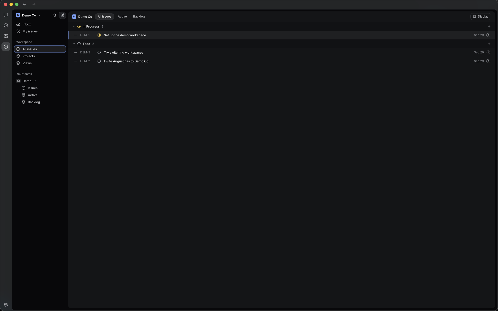

# Jaz Tasks

A self-hosted issue tracker in the style of Linear, shared by people and AI agents. One Go server backed by Postgres serves the web app, an MCP server and a Linear-compatible GraphQL API over the same data.



## Capabilities

- **Issues:** status, priority, assignee, labels, estimate, due date, cycle, sub-issues, comments and history.
- **Projects:** status, lead, teams, start and target dates, and a markdown brief that holds the plan. The timeline lays projects out by date; drag a bar to reschedule it.
- **Views:** list and board grouped by status with drag and drop, My issues, Inbox and saved views. Linear's keyboard shortcuts work: `C` create, `⌘K` command palette, `J`/`K` move, `S`/`P`/`A`/`L` status, priority, assignee, labels, `⌘B` switch layout.
- **Workspaces:** OpenID Connect sign-in, a workspace for each new person, invites and switching. Every query, tool and token is scoped to one workspace, and tests attack other tenants by id through GraphQL and MCP.

## Clients

| Client | Connects through |
| --- | --- |
| People | The web app at `PUBLIC_URL`, signing in with any OpenID Connect provider. |
| Jaz | `/mcp`. Jaz shows the app as a Tasks section in its sidebar and renders a card for each issue an agent creates. |
| Claude Code and other MCP clients | `/mcp`: `claude mcp add --transport http jaz-tasks https://tasks.example.com/mcp` |
| Linear clients and scripts | `/graphql` with an API key, for example [linear-cli](https://github.com/gluonfield/linear-cli). |

## ChatGPT plugin

The existing MCP server and embedded app can be connected to ChatGPT using OAuth. See [setup, packaging and remaining requirements](docs/chatgpt-plugin.md); `plugin/` contains the portable manifest and ZIP packager.

## MCP

`/mcp` is a Streamable HTTP server on the same service layer as the web app. Clients that support OAuth discover the authorization server from the first 401 and ask you to sign in and consent; others send an API key as `Authorization: Bearer <key>`. Tools take names: teams by key or name, people by name, email or `me`, and `none` clears a field.

| Tool | Does |
| --- | --- |
| `list_teams`, `list_users` | teams with their workflow states and labels; workspace members |
| `list_projects`, `get_project` | projects with dates and progress; one project with its markdown brief |
| `create_project`, `update_project` | status, lead, teams, dates, description and brief |
| `list_issues` | filter by team, state, assignee, project, label, priority or full-text query |
| `get_issue` | an issue with its description, sub-issues and comments |
| `create_issue`, `update_issue` | every property, including moving teams and clearing fields |
| `add_comment` | a markdown comment as the signed-in user |
| `show_tasks` | opens the app at a team, issue or section |

The server is also an [MCP App](https://github.com/modelcontextprotocol/ext-apps). `ui://jaz-tasks/app` is the whole web app in one HTML document, which a host such as Jaz renders in a sandboxed frame and themes to match ([frontend/THEMING.md](frontend/THEMING.md)). The app reads and writes through an app-only `graphql` tool.

`show_tasks` declares a `global` entrypoint from [OpenAI's MCP extensions](https://github.com/openai/mcp-extensions), so hosts that support the schema, Jaz among them, give Tasks its own section in their sidebar:

```json
"_meta": {
  "ui": { "resourceUri": "ui://jaz-tasks/app" },
  "openai/ui": { "entrypoints": [{ "type": "global" }] }
}
```

## GraphQL

`POST /graphql` implements the part of [Linear's schema](https://github.com/linear/linear/blob/master/packages/sdk/src/schema.graphql) that Linear clients use, with Linear's names, shapes, filters, `ENG-123` identifiers and error format. Anything outside [`schema.graphqls`](backend/internal/httpapi/gql/schema.graphqls) fails validation, and `go test` replays the exact documents linear-cli sends. Authenticate with an OAuth token (`Bearer <token>`) or, as in Linear, a raw API key.

```sh
curl -s localhost:7400/graphql -H "Authorization: $KEY" -H 'Content-Type: application/json' \
  -d '{"query":"{ issues(filter: { state: { type: { eq: \"started\" } } }) { nodes { identifier title } } }"}'
```

## Run it

```sh
cp .env.example .env   # set PUBLIC_URL and the OIDC_* values
docker compose up
```

The server listens on http://localhost:7400 and Postgres on host port 55432. The first person to sign in gets a workspace of their own.

For Google sign-in, create an OAuth client of type *Web application* in Google Cloud Console (APIs & Services > Credentials) with `<PUBLIC_URL>/auth/callback` as an authorized redirect URI. Other OpenID Connect providers work the same way; `.env.example` also shows Cognito.

```sh
PUBLIC_URL=https://tasks.example.com
OIDC_ISSUER=https://accounts.google.com
OIDC_CLIENT_ID=1234-abc.apps.googleusercontent.com
OIDC_CLIENT_SECRET=GOCSPX-...
```

| Variable | Purpose |
| --- | --- |
| `PUBLIC_URL` | Base URL; sets the OIDC redirect URI, OAuth issuer, metadata URLs and cookie domain |
| `OIDC_ISSUER`, `OIDC_CLIENT_ID`, `OIDC_CLIENT_SECRET` | OpenID Connect provider |
| `ALLOWED_EMAIL_DOMAINS`, `ALLOWED_EMAILS` | Optional sign-in allowlist; a verified email is always required |
| `OWNER_EMAIL`, `OWNER_API_KEY` | Optional account and key created at startup, so agents can connect before anyone signs in |
| `DATABASE_URL`, `ADDR`, `WEB_DIR`, `LOG_LEVEL` | Server basics |

Jaz Tasks is its own OAuth 2.1 authorization server, with discovery metadata (RFC 9728, RFC 8414), dynamic client registration, PKCE, rotating refresh tokens with reuse detection and revocation. Tokens and keys are opaque and stored hashed. Create personal API keys in Settings or with `docker compose exec server /app/server apikey <email>`.

## Develop

Requirements: Go 1.26, Docker, [sqlc](https://sqlc.dev) and [Bun](https://bun.sh).

```sh
docker compose up -d postgres
cd backend
go run ./cmd/server            # API on :7400; --web-dir serves a built web app
go test ./...                  # needs the compose Postgres (or TEST_DATABASE_URL)
sqlc generate                  # after editing queries or migrations
(cd internal/httpapi/gql && go tool gqlgen generate)   # after editing the schema
```

```sh
cd frontend
bun install
bun run dev                    # http://localhost:7401, proxies the API to :7400
bun run check                  # typecheck, lint, build
```

The web app is a TanStack Start SPA with TanStack Query, Tailwind v4 and shadcn/ui, and talks to the server only through `/graphql`.

```
backend/
  cmd/server                entrypoint (serve, apikey)
  internal/app              Fx wiring and config
  internal/server           HTTP shell: routing, auth, CORS, web app
  internal/tracker          issue-tracking domain service
  internal/httpapi/gql      Linear-compatible GraphQL (gqlgen)
  internal/httpapi/mcpapi   MCP tools and the MCP App
  internal/httpapi/authapi  sign-in, OAuth endpoints and settings
  internal/auth             sessions, OIDC, OAuth grants, API keys
  internal/workspaces       sign-up, invites, workspace switching
  internal/storage          storage contracts; postgres/ holds migrations, queries and sqlc output
frontend/
  src/routes                TanStack file routes
  src/components            views, pickers, dialogs; ui/ holds shadcn primitives
  src/lib                   GraphQL client, queries, theme bridge, shared types
```
